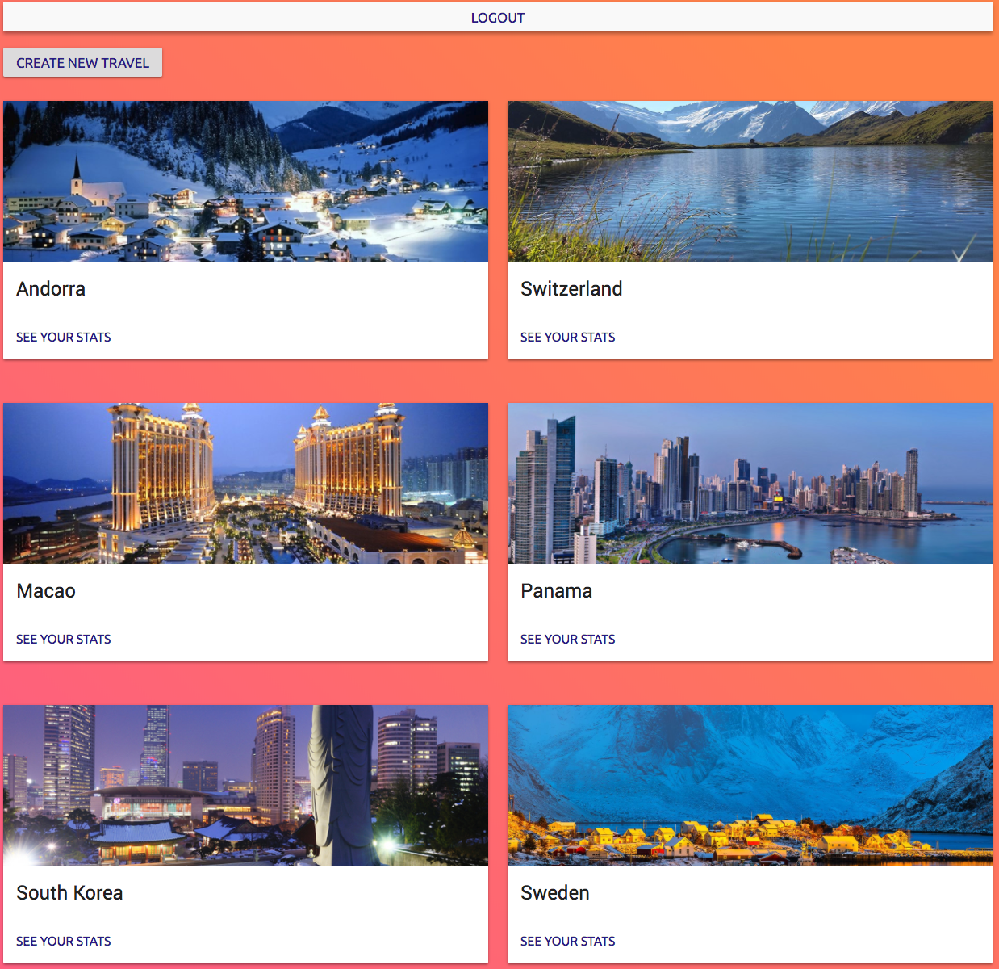
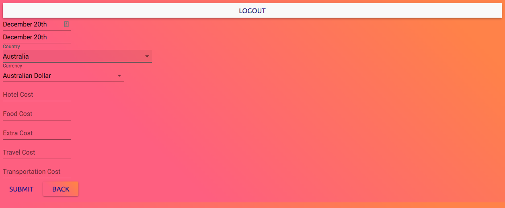
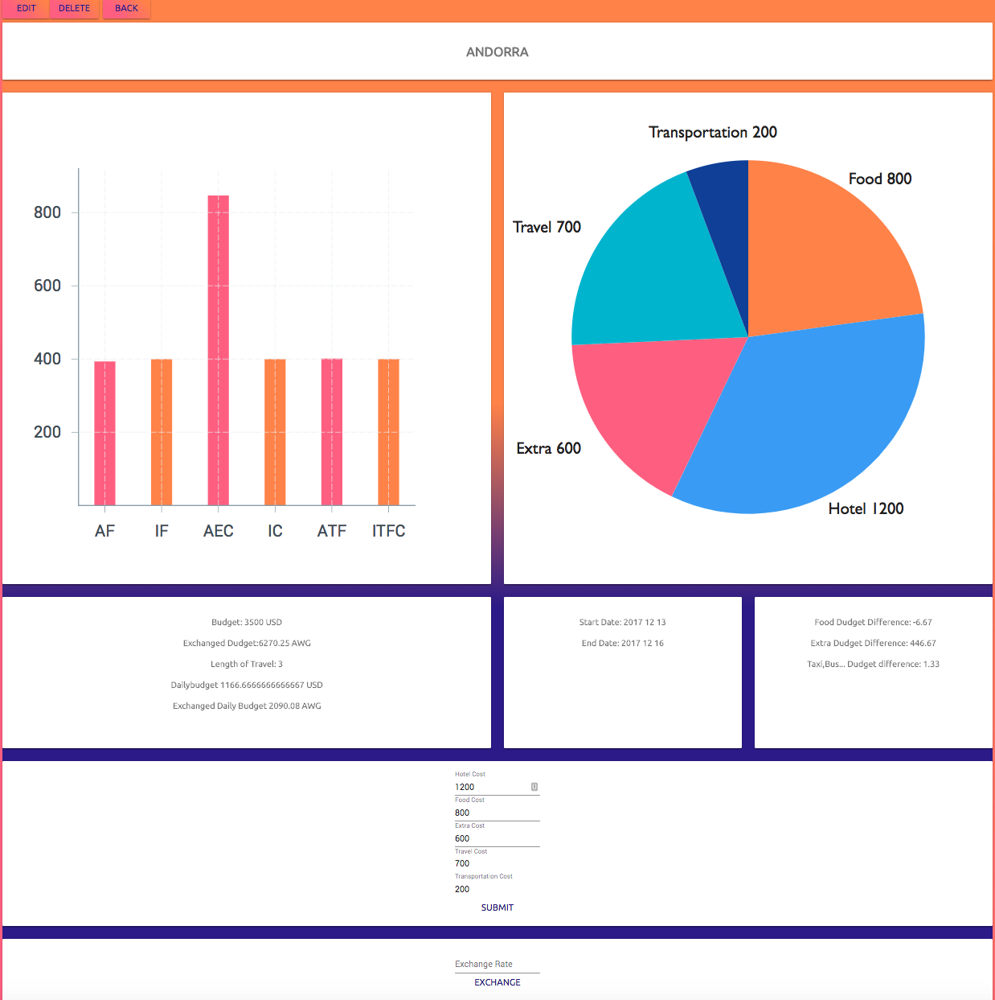

# WDI PROJECT 2 ( readme in construction)

## GA WDI30 Project 2: 'Saver'

Saver is MERN stack application build with React, node.js, material-ui. This mobile and desktop app helps the user take control of his budget when traveling around the world by getting the exchange rate in real time. It also helps the user by creating real time charts of its spending that can be updated everyday. All trips are only available to the user who created them and the user can keep them for further references for another trip. Finally the user can also calculate the exchange rate of a sum in real-time.

## Why this project?

I spend my life travelling around the world and changing from one currency to the other is sometimes complicated and time consuming especialy when you are doing a serie of short trip.It is easy to lose track of your budget.

## Libraries /Setup/ external stylesheets used

React
Material-ui
Babel
Chai
Mocha
Enzyme
Sinon
Webpack
Axios
Bcrypt
Bluebird
Express
Jsonwebtoken
Material-design-icons
Moment.js
Node.js
Mongoose
Morgan
Victory

App link: [https://frozen-cliffs-27123.herokuapp.com/ ]()

## Challenges:

After only a week of React to prepare us to build this application it was really challenging to do so.
The front end was especially a challenge for me.
I had most of my logic on my view page so when I add to style it it was breaking my app. I solved the issue by passing them as constant so that I could call them easily into my styling app. I think that if I had used redux this app it would have solved many of my problem but I learned it after the course. 
Moment.js also had its share of technicalities in the sense that I needed it to display a date that looks pretty meanwhile using the coding date so the web browser recognises is as a date. There was a lot of playing around and breaking the app to fix this issue.

## strenght:

I also did a wireframe that helps me set my goals at the beginning and realize what was duable in a bit more than a week. The authentications, back end and logic behind my app went well in their setting up. In part because of using victory chart, I just had to pass the data in which really helped me to save time. My API was easy to use which saved me a lot of time as well. I made. a function that use the currency code that it set when the user register and similarly when the user create a function it fetch the currency code replace it in the APi link so that I can thenr retrieve the exchange rate in real time. 

## for the future:

* The app responsiveness be improved
* A few minor styling elements can be improved so it looks more finished
* I would like to link this app to a bank app that I will do in the future so that it gives you a recommended budget based on your everyday spendings.

 

